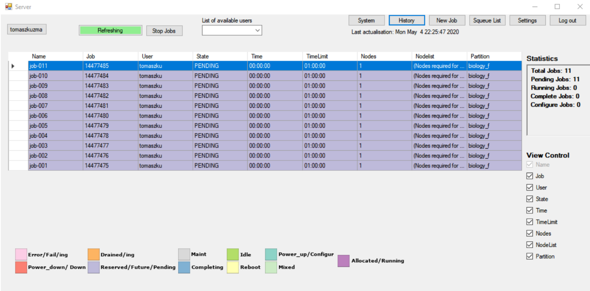
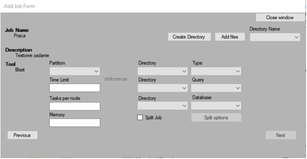
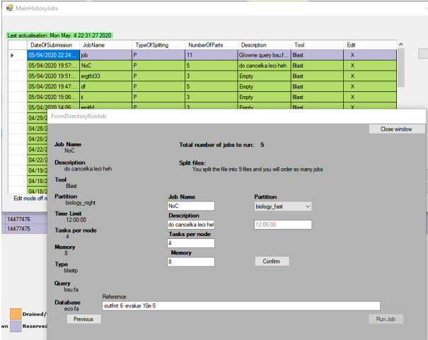
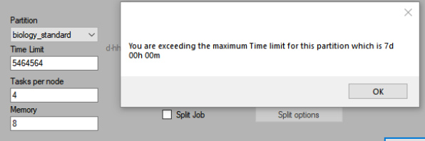
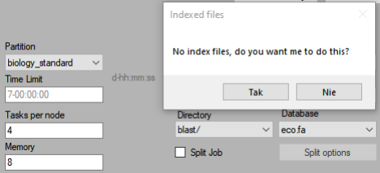
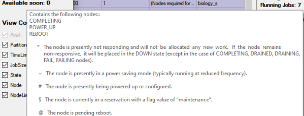

# GMOSS - graficzny monitor systemu slurm - graphical slurm system monitor 
> 
> 

## Table of Contents
* [General Info](#general-information)
* [Technologies Used](#technologies-used)
* [Features](#features)
* [Screenshots](#screenshots)
* [Setup](#setup)
* [Project Status](#project-status)
* [Room for Improvement](#room-for-improvement)
<!--* [Acknowledgements](#acknowledgements)
* [Contact](#contact)
* [License](#license) -->
<!--* [Usage](#usage)-->

## General Information
This tool is a graphic interface to system queue - SLURM "“Simple Linux Utility for Resource Management”.
This program was created mainly for the preview of the current queue system embedded on the servers of the Poznań Supercomputing and Networking Center, specifically on the "eagle" cluster.
Additionally I focused on adding a blast job builder.

## Technologies Used
- The tool is written in C # in Visual Studio 2019 on .NET Framework on Windows 10.
- The device was also tested on Linux on Ubuntu 18.04 with using Mono version 6.8.0.
- Some of the data used by the program were pre-transformed after server side using Linux commands.

## Features
List the ready features here:
- Task control, automatic background refresh 
- Possibility to add blast tasks - control of the correct task order 
- Possibility to divide added tasks into smaller subtasks 
- History of added tasks, error messages 
- Graphical representation of the server load 
- Control over running tasks, removing, modification, and resuming tasks 

## Screenshots

<!-- If you have screenshots you'd like to share, include them here. -->

## Setup
### Linux
` sudo apt update `

` sudo apt install dirmngr gnupg apt-transport-https ca-certificates `

` sudo apt-key adv --keyserver hkp://keyserver.ubuntu.com:80 --recv-keys 3FA7E0328081BFF6A14DA29AA6A19B38D3D831EF `

` sudo sh -c 'echo "deb https://download.mono-project.com/repo/ubuntu stable-bionic main" > /etc/apt/sources.list.d/mono-official-stable.list' `

` sudo apt update `

` sudo apt install mono-complete `

` sudo apt install libcanberra-gtk-module libcanberra-gtk3-module `

` sudo apt install xcb `

<!--
## Usage

How does one go about using it?
Provide various use cases and code examples here.

`write-your-code-here`

-->
## Project Status
Project is: _no longer being worked on_. 

## Room for Improvement

Room for improvement:
- Code improvement
- GC improvement
- Problem with memory after long run

To do:
- Add more bioinformatic tools
- Add tools non-bioinformatics

<!--
## Acknowledgements
Give credit here.
- This project was inspired by...
- This project was based on [this tutorial](https://www.example.com).
- Many thanks to...

-->

<!-- Optional -->
<!-- ## License -->
<!-- This project is open source and available under the [... License](). -->

<!-- You don't have to include all sections - just the one's relevant to your project -->
